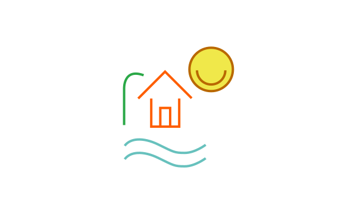
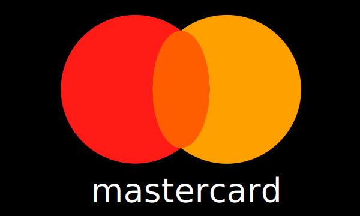
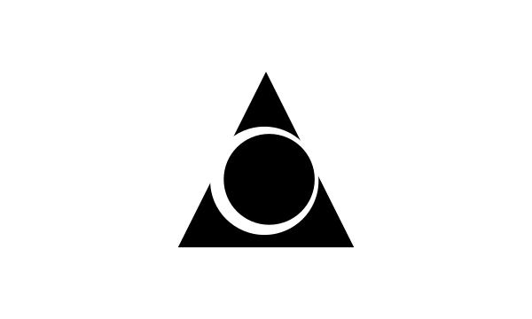
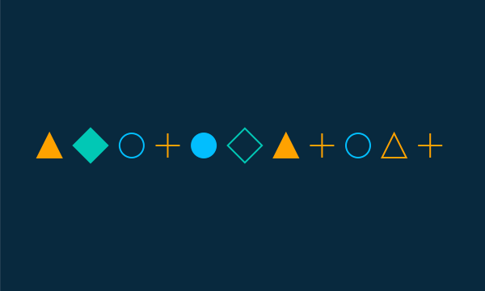

# Jouons avec des formes

> A JS exercise use at HEPL for MMI.

* * *

**playing-with-shapes** is an educational project, which will be used for `JS` courses.

**Note:** the school where the course is given, the [HEPL](http://www.provincedeliege.be/hauteecole) from Liège, Belgium, is a French-speaking school. From this point, the instruction will be in French. Sorry.

* * *

Dans le cadre de cet exercice, nous vous demandons de dessiner<canvas> des formes géométriques simples

## Énoncé

Essayez de reproduire ces illustrations. Le fichier source se trouve [ici](src/shapes/shapes.ai). L'idée étant de découvrir l'API Canvas. Vous pouvez voir le résultat [ici](https://hepl-mmi.github.io/playing-with-shapes/). Nous vous proposons de construire une petite librairie qui vous permet de dessiner les formes qui reviennent. Par exemple, rectangle, cercle, triangles, etc.

Ici, nous vous demandons de générer aléatoirement la séquence de formes ainsi que sa couleur et le fait qu'elle soit pleine ou pas.

